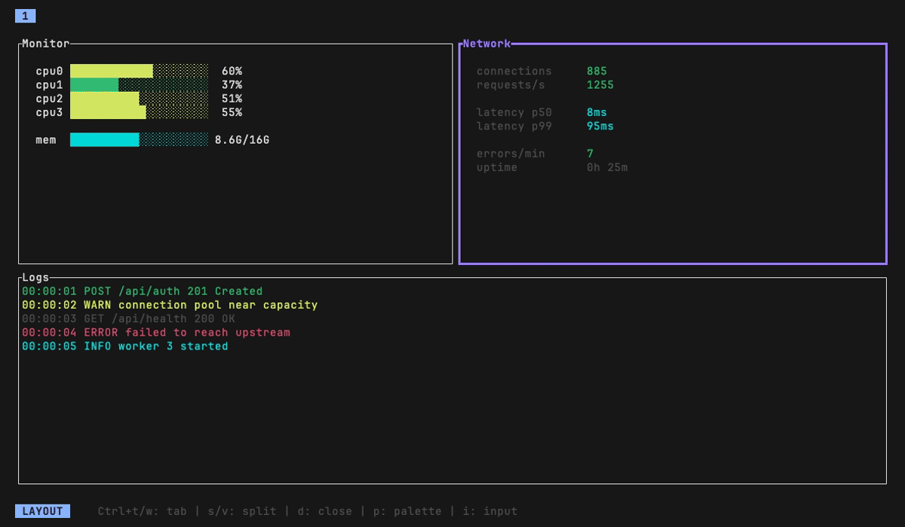

[](https://github.com/nikolic-milos/ratatui-hypertile/actions/workflows/ci.yml)
[](https://crates.io/crates/ratatui-hypertile)
[](https://docs.rs/ratatui-hypertile)

Hyprland-inspired BSP tiling engine for Ratatui.

Cook up delicious TUIs with layouts you can split, move, resize, and tweak at
runtime.

---

<h3>ratatui-hypertile</h3>

The core engine. You give it an area, it gives you rectangles. Handles the
tree, layout math, focus tracking, and pane movement. Use this if you want
full control over input and rendering.

<h3>ratatui-hypertile-extras</h3>

Wraps the core into a runtime with batteries. Register plugins, feed it
events, call render. Ships with vim-style keymaps, a command palette for
swapping plugins on the fly, and workspace tabs. Write a plugin by
implementing `render` on `HypertilePlugin` and you're set.

---

<h3>Try it yourself</h3>

```sh
cargo run --example basic
cargo run --example core_only
```
