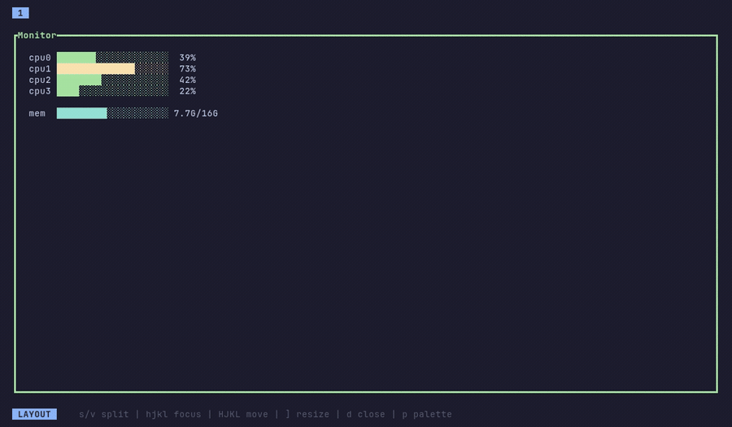

[](https://github.com/nikolic-milos/ratatui-hypertile/actions/workflows/ci.yml)
[](https://crates.io/crates/ratatui-hypertile)
[](https://docs.rs/ratatui-hypertile)

Cook up delicious terminal interfaces with Hyprland-style tiling for [Ratatui](https://github.com/ratatui/ratatui). Tile your panes, switch between tabs, drag borders and whole panes with the mouse, and watch them glide into place. Save the layout for when you want it back.

## Two crates to tile them all

[`ratatui-hypertile`](https://crates.io/crates/ratatui-hypertile) is the core engine. You give it an area, it gives you rectangles. It tracks the tree, focus, and movement, and otherwise stays out of your way. Reach for this when you want full control.

[`ratatui-hypertile-extras`](https://crates.io/crates/ratatui-hypertile-extras) wraps the core in a ready-to-go runtime: plugins, vim keymaps, a command palette, workspace tabs, and pane-move animations. Implement `HypertilePlugin` and you're set.

## Try it out

From the repo root:

```sh
cargo run -p ratatui-hypertile-extras --example basic
cargo run --example core_only
```

## Quickstart

Add one (or both) to your `Cargo.toml`:

```toml
ratatui-hypertile = "0.4"
ratatui-hypertile-extras = "0.4"
```

```rust
use ratatui::layout::{Direction, Rect};
use ratatui_hypertile::Hypertile;

let mut layout = Hypertile::new();
layout.split_focused(Direction::Horizontal)?;
layout.compute_layout(Rect::new(0, 0, 80, 24));

for pane in layout.panes_iter() {
    draw_pane(pane.rect, pane.is_focused);
}
```

## FAQ

**Why not just use tmux or Zellij?**

They solve a different problem. tmux and Zellij are multiplexers: they tile whole programs in your terminal. ratatui-hypertile is a library that adds tiling inside a single Ratatui app, so the panes your app draws can split, focus, and resize. The two are not mutually exclusive. You can run a hypertile app inside tmux or Zellij just fine.

## License

This project is licensed under the [MIT License](LICENSE).
